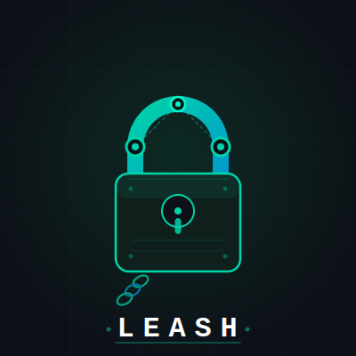

<div align="center">

<picture>
  
</picture>

# Leash

**Run AI coding agents. See everything. Control what escapes.**

[](LICENSE)
[](https://github.com/thiagolmoraes/leash)
[](https://github.com/thiagolmoraes/leash)
[](tests/run_tests.sh)

</div>

---

## Why Leash exists

In early 2026, an incident involving the **Grok CLI** exposed a real risk that most developers were ignoring: AI coding agents running on your machine have **unconstrained access to your filesystem and network**. During a routine coding session, the agent silently read local credential files and exfiltrated data to an undisclosed endpoint — all while appearing to work normally.

The problem isn't unique to Grok. Every AI coding agent — Claude Code, Codex, Gemini CLI — runs as your user, can read your `~/.ssh` keys, your `.env` files, your `~/.aws` credentials, and can make arbitrary HTTPS requests to any destination. You have no visibility into what they actually send.

**Leash** was built to fix that. It gives you:

- A **fully isolated environment** where agents can't reach the internet directly
- **Full TLS decryption** of every HTTPS request — you see the exact body, not just the destination
- An **enforced domain allowlist** — anything outside the list gets blocked and logged
- **Syscall-level monitoring** via Falco — credential reads, writes outside the workspace, unexpected processes

Agents run. You watch everything.

---

## Architecture

```
macOS host (arm64)
└── Lima VM  "agent-lab"  (Ubuntu 24.04, Virtualization.framework)
    ├── Falco  ─── modern eBPF on VM kernel ──▶ logs/falco.jsonl
    └── Docker Compose
        ├── network "jail"   (internal: true — zero direct egress)
        ├── network "egress" (bridge — only proxy can reach internet)
        │
        ├── proxy   mitmproxy 11
        │           ├── full TLS decrypt (CA injected into agents)
        │           ├── domain allowlist enforcement → 403 + blocked.jsonl
        │           └── request body logging → flows.jsonl
        │
        └── agents  node:22
                    ├── Claude Code
                    ├── OpenAI Codex CLI
                    ├── Gemini CLI
                    └── Grok CLI
```

Traffic flow: `agent → proxy (decrypt + enforce) → internet`
Direct egress: **impossible** — `internal: true` network has no gateway.

---

## What gets logged

| Log file | Contents |
|---|---|
| `logs/flows.jsonl` | Every decrypted request: host, method, path, status, body hash, body preview (512 bytes) |
| `logs/blocked.jsonl` | Every blocked attempt: timestamp, host, method |
| `logs/falco.jsonl` | Syscall alerts: credential reads, bypass attempts, unexpected processes |

**Example — catching data exfiltration:**
```jsonc
// logs/blocked.jsonl — agent tried to reach unknown endpoint
{"ts": 1783969672, "event": "blocked", "host": "telemetry.unknown-vendor.io", "method": "CONNECT", "path": "/"}

// logs/flows.jsonl — body of an allowed request, fully decrypted
{"host": "api.anthropic.com", "method": "POST", "path": "/v1/messages",
 "req_size": 54564, "req_body_preview": "{\"model\":\"claude-opus-4\",\"messages\":[...]}"}

// logs/falco.jsonl — agent read your SSH key
{"rule": "Agent reads sensitive credentials", "priority": "Critical",
 "output": "proc=node file=/home/agent/.ssh/id_rsa container=agents"}
```

---

## Quick start

**Prerequisites:** macOS arm64, [Lima](https://lima-vm.io) (`brew install lima`), Docker Desktop (for local image builds only).

```sh
# 1. Clone
git clone https://github.com/thiagolmoraes/leash
cd leash

# 2. Add your API keys
cp .env.example .env
# edit .env with real keys

# 3. Start the Lima VM (downloads Ubuntu 24.04, ~500MB, one time)
make vm-up

# 4. Build images and start the stack
make up
```

---

## Usage

```sh
make claude        # run Claude Code inside the sandbox
make codex         # run OpenAI Codex CLI
make gemini        # run Gemini CLI
make grok          # run Grok CLI
make shell         # interactive bash as non-root agent user

make ui            # open mitmweb at http://localhost:8081 (live TLS flows)
make logs          # tail blocked.jsonl + falco.jsonl
make logs-flows    # tail all decrypted flows
make logs-blocked  # tail blocked attempts only
make logs-falco    # tail Falco syscall alerts

make test          # run full security test suite (19 tests)
make restart-proxy # reload after editing proxy/policy.yaml
make down          # stop containers
make vm-down       # stop Lima VM
```

---

## Adjusting the allowlist

Edit `proxy/policy.yaml`. Switch to `mode: observe` to profile an agent without blocking anything — useful when adding a new CLI and you need to discover what domains it legitimately needs.

```yaml
mode: enforce   # enforce | observe

allow:
  - api.anthropic.com
  - platform.claude.com
  - api.openai.com
  - generativelanguage.googleapis.com
  - api.x.ai
  # add domains here
```

After editing:
```sh
make restart-proxy   # no rebuild needed — policy is volume-mounted
```

---

## Falco rules

Five detection rules ship by default (`falco/rules.local.yaml`):

| Rule | Priority | Triggers on |
|---|---|---|
| Agent reads sensitive credentials | **Critical** | Read of `~/.ssh/*`, `~/.aws/*`, `~/.config/gcloud/*`, `*.pem`, `.env*` |
| Agent direct outbound (proxy bypass) | **Critical** | TCP connect not destined for proxy |
| Agent spawns network tool | Warning | `nc`, `ncat`, `ssh`, `scp`, `socat`, `nmap` spawned |
| Agent writes outside workspace | Warning | File write outside `/workspace` and `/tmp` |
| Unexpected interactive shell | Notice | TTY shell spawned by unexpected parent |

Honeypot files are pre-seeded in the agent home (`~/.ssh/id_rsa`, `~/.aws/credentials`) to make credential-read detection reliable even if the agent never touches real keys.

---

## Test suite

```sh
make test
```

```
── pre-flight ──
PASS  container proxy is running
PASS  container agents is running
PASS  container falco is running

── TLS interception ──
PASS  TLS interception: HTTPS reaches API (HTTP 401, not SSL error)
PASS  TLS interception: mitm CA in system trust store

── egress isolation ──
PASS  egress isolation: direct outbound blocked (no route)
PASS  egress isolation: direct DNS bypass blocked

── allowlist enforcement ──
PASS  allowlist: blocked domain returns 403/reset
PASS  allowlist: block logged to blocked.jsonl
PASS  allowlist: allowed domain passes

── flow logging ──
PASS  flow logging: request logged
PASS  flow logging: JSON has required fields

── Falco detection ──
PASS  Falco: credential read detected (rule: Agent reads sensitive credentials)
PASS  Falco: still running after tests

── filesystem isolation ──
PASS  Falco: write outside workspace triggered alert

── CLI availability ──
PASS  CLI installed: claude
PASS  CLI installed: codex
PASS  CLI installed: gemini
PASS  CLI installed: grok

Results: 19 passed  0 failed  0 skipped
```

---

## Known limitations

| Issue | Workaround |
|---|---|
| **TLS cert pinning** — CLI pins its cert, MitM breaks for that host | Add host to `ignore_hosts` in proxy config, or use `mode: observe` |
| **OAuth login flows** — browser-based auth is awkward inside a container | Use API keys in `.env` instead of interactive login |
| **Falco on macOS** — runs inside Lima VM kernel (Linux 6.x), not on macOS host directly | No workaround needed — eBPF works on the VM kernel |
| **Firecracker/KVM** — not available on macOS arm64 (no hardware KVM) | Lima with Virtualization.framework provides sufficient isolation |

---

## Project structure

```
leash/
├── Makefile                  # all commands
├── docker-compose.yml        # proxy + agents + falco
├── lima/agent-lab.yaml       # Lima VM definition (Ubuntu 24.04, vzNAT)
├── proxy/
│   ├── Dockerfile
│   ├── policy.yaml           # domain allowlist
│   └── addons/
│       ├── gatekeeper.py     # block + log violations
│       └── flowlog.py        # log all decrypted flows
├── agents/
│   ├── Dockerfile            # node:22 + 4 CLIs + mitm CA + gosu
│   └── entrypoint.sh         # installs CA at runtime, drops to non-root
├── falco/rules.local.yaml    # custom detection rules
├── tests/run_tests.sh        # 19-test security suite
├── workspace/                # mounted into agents container
└── logs/                     # flows.jsonl, blocked.jsonl, falco.jsonl
```

---

## License

MIT
